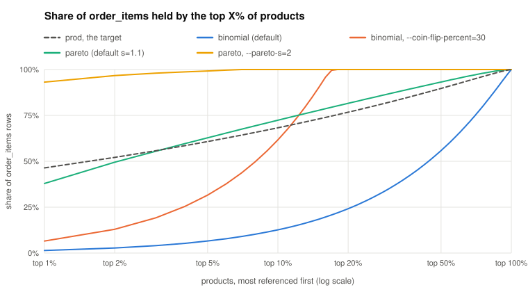

# Random data generator for MySQL and PostgreSQL
Forked from https://github.com/Percona-Lab/mysql_random_data_load

This tool aims to produce a quick working environment to reproduce a query execution behavior in order to optimize it.
It is meant for cases where we cannot access real data, only schema and cardinalities. 

Based on the table(s) schema and a query, it will generate random data with respect to fields, foreign keys defined in databases, foreign keys infered from the query pattern, (plan: from existing cardinalities and distributions). 

## Usage
`random-data-load run --engine=(mysql|pg) --rows=INT-64 (--query=SELECT ...|--table=table_name) [options...]`


### Example

A query is reported slow. It walks a category tree with a recursive CTE and sums revenue per top-level category. We have its schema and its `EXPLAIN ANALYZE` (`plan.txt`), but not its data.

```sql
CREATE TABLE categories (
    id        int PRIMARY KEY GENERATED ALWAYS AS IDENTITY,
    parent_id int REFERENCES categories (id),          -- points at itself
    name      text NOT NULL
);
CREATE TABLE products (
    id          int PRIMARY KEY GENERATED ALWAYS AS IDENTITY,
    category_id int NOT NULL REFERENCES categories (id),
    name        text NOT NULL,
    price       numeric(10,2) NOT NULL
);
CREATE TABLE order_items (
    order_id   bigint NOT NULL,
    product_id int NOT NULL,                           -- no foreign key declared
    quantity   int NOT NULL
);
CREATE INDEX ON order_items (product_id);
```

```sql
-- query.sql
WITH RECURSIVE tree AS (
    SELECT id, id AS root_id FROM categories WHERE parent_id IS NULL
  UNION ALL
    SELECT c.id, t.root_id FROM categories c JOIN tree t ON c.parent_id = t.id
)
SELECT t.root_id, sum(oi.quantity * p.price) AS revenue
FROM tree t
JOIN products p     ON p.category_id = t.id
JOIN order_items oi ON oi.product_id = p.id
GROUP BY t.root_id
ORDER BY revenue DESC
LIMIT 10;
```

**1. Read the sizes off the plan.**

```
$ random-data-load explain-stat --engine=pg plan.txt
Tables
  categories                      300 rows        2 pages     8 bytes/row   (sequential scan actual rows + rows removed by filter)
  order_items                 1000000 rows     5406 pages     8 bytes/row   (sequential scan actual rows + rows removed by filter)
  products                      20000 rows      187 pages    14 bytes/row   (sequential scan actual rows + rows removed by filter)
...
Flags for the run
  --rows="categories=300;order_items=1000000;products=20000"
```

**2. Generate the data.** Connection flags (`--host`, `--user`, ...) are left out here.

```
$ random-data-load run --engine=pg --database=shop --query="$(cat query.sql)" \
    --rows="categories=300;order_items=1000000;products=20000" \
    --self-fk-depth=3 --self-fk-roots=0.1 \
    --pareto="products=order_items" \
    --target-relpages="products=187"
INF categories points at itself, so its 300 rows are inserted as a tree of 3 levels, roots first: 30, 76, 194. ...
INF aiming products at 187 pages: 20000 rows over 187 pages is 48 bytes per row
INF products comes out at 32 bytes per row on its own; filling name=29 to reach 48, which lands on 48
```

- `categories` is a 3-level tree with 10% of its rows as roots, so the recursive CTE has 3 levels to walk
- `products.category_id` comes from the declared foreign key. `order_items.product_id` has no declared key, so the tool guesses it from the join, and every order item points at a real product
- `--pareto` makes a few products hot and leaves a long tail, the way real sales look
- `--target-relpages` widens `products` to its reported page count, which sets the cost of scanning it

**3. Check the data against the plan.**

```
$ random-data-load verify --engine=pg --database=shop --query="$(cat query.sql)" plan.txt --all
Rows  (sequential scan actual rows + rows removed by filter)
  public.categories                            reported          300   generated          300    +0.0%   ok
  public.order_items                           reported      1000000   generated      1000000    +0.0%   ok
  public.products                              reported        20000   generated        20000    +0.0%   ok

Pages
  public.categories                            reported            2   generated            2    +0.0%   ok
  public.order_items                           reported         5406   generated         5412    +0.1%   ok
  public.products                              reported          187   generated          188    +0.5%   ok
...
Every figure with a target sits within 0.0500 of it.
```

**4. Compare the plans.** The generated database gets the reported plan, node for node, at nearly the same costs: 325462 here against 325475 reported.

```
Limit  (cost=325462.07..325462.10 rows=10 width=36)
  CTE tree
    ->  Recursive Union  (cost=0.00..267.55 rows=4080 width=8)
          ->  Seq Scan on categories  (cost=0.00..5.00 rows=30 width=8)
                Filter: (parent_id IS NULL)
          ->  Hash Join  (cost=8.75..22.18 rows=405 width=8)
                Hash Cond: (t_1.id = c.parent_id)
                ->  WorkTable Scan on tree t_1  (cost=0.00..6.00 rows=300 width=8)
                ->  Hash  (cost=5.00..5.00 rows=300 width=8)
                      ->  Seq Scan on categories c  (cost=0.00..5.00 rows=300 width=8)
  ->  Sort  (cost=325194.52..325195.02 rows=200 width=36)
        Sort Key: (sum(((oi.quantity)::numeric * p.price))) DESC
        ->  HashAggregate  (cost=325187.70..325190.20 rows=200 width=36)
              Group Key: t.root_id
              ->  Hash Join  (cost=8632.70..189187.70 rows=13600000 width=16)
                    Hash Cond: (oi.product_id = p.id)
                    ->  Seq Scan on order_items oi  (cost=0.00..15412.00 rows=1000000 width=8)
                    ->  Hash  (cost=3903.70..3903.70 rows=272000 width=16)
                          ->  Hash Join  (cost=638.00..3903.70 rows=272000 width=16)
                                Hash Cond: (t.id = p.category_id)
                                ->  CTE Scan on tree t  (cost=0.00..81.60 rows=4080 width=8)
                                ->  Hash  (cost=388.00..388.00 rows=20000 width=16)
                                      ->  Seq Scan on products p  (cost=0.00..388.00 rows=20000 width=16)
```

**5. Tune the key distribution.** How many order items each product gets is decided by the sampler chosen for the `products=order_items` key. The chart compares the reported database with four settings, each one a run of 1,000,000 order items over the same 20,000 products:

<picture>
  <source media="(prefers-color-scheme: dark)" srcset="docs/fk-distribution-dark.svg">
  
</picture>

|Share of order_items held by|top 1% of products|top 10%|top 50%|
|---|---|---|---|
|reported database (the target)|46%|68%|90%|
|`--binomial` (the default, `--coin-flip-percent=1`)|1%|13%|56%|
|`--binomial --coin-flip-percent=30`|7%|62%|100%|
|`--pareto` (`--pareto-s=1.1`, the default)|38%|72%|93%|
|`--pareto --pareto-s=2`|93%|100%|100%|

- the default binomial coin flip spreads children almost evenly across their parents
- a higher `--coin-flip-percent` concentrates them on the first parents of each sample: at 30%, only about 18% of the products are used at all
- `--pareto` gives a hot head and a long tail. `--pareto-s` sets how fast it decays, and the default 1.1 is the closest match to the reported database here

## Options

Common options:

|Option|Description|
|------|-----------|
|--engine|mysql/pg|
|--host|Host name/ip|
|--user|Username|
|--password|Password|
|--port|Port number|
|--quiet|Do not print progress bar|
|--dry-run|Print queries to the standard output instead of inserting them into the db|
|--debug|Show some debug information|
|--pprof|Generate pprof trace at --cpu-prof-path. Also opens port 6060 for pprof go tool|
|--version|Show version and exit|
|--help-tuning|Print what each tuning flag moves — table size, row width and page count, value frequency, key fan-out — and exit. The flags' own `--help` says what they do in one line; this says why you would reach for them|
|--rows|Number of rows to insert. One number for every table, or per table, or both: `--rows="1000;orders=500000;order_items=1500000"` fills orders and order_items with their own counts and everything else with 1000|
|--bulk-size|Number of rows per INSERT statement (Default: 1000)|
|--workers|how many workers to spawn. Only the random generation and sampling are parallelized. Insert queries are executed one at a time (Default: 3)|
|--table|Table to insert to. When using --query, --table will be used to restrict the tables to insert to.|
|--query|Providing a query will analyze its schema usage, insert recursively into tables, and identify implicit joins|
|--no-skip-fields|Disable field whitelist system. When using a --query, it will get the list of fields being used as a whitelist in order to generate the minimal sets of fields required, unless --no-skip-fields is being used or any * has been found.|
|--null-freq|How often a nullable column is NULL, as a fraction between 0 and 1. One number for every column, or per column, or both: `--null-freq="0.1;t1.c1=0.73;t1.c2=0.04"` leaves every other column at 10% and sets 73% and 4% on those two (Default: 0.1)|
|--values-freq-map|Inject arbitrary values at fixed frequencies. The format is "--values-freq-map=t1.c1=val1:0.75,val2:0.23;t1.c2=10:0.99" so that val1 will be on 75% of rows and val2 on 23% for column c1|
|--query-param-freq|Insert the literals the `--query` compares a column to, on this fraction of the rows, so the query returns something. Defaults to 0: it is a selectivity nobody measured, so it is only applied when asked for, and it then overrides anything `--stat-file` says about those values. The run names the predicates nothing will match|
|--stat-file|Scan a column statistics export and reuse its null_frac, most_common_vals and most_common_freqs instead of setting --null-freq and --values-freq-map by hand, and its avg_width instead of setting --target-bytes-per-row. Use the `export-stat` subcommand to get the command producing that file|
|--min-generated-time|Generated timestamps will be after this date. Format is RFC3339. Will default to --max-generated-time - 1 year|
|--max-generated-time|Generated timestamps will be before this date. Format is RFC3339. Will default to now()|

Foreign key sampling options:
|Option|Description|
|------|-----------|
|--add-fk|Add foreign keys, if they are not explicitely created in the table schema. It can complement the foreign keys guessed from the --query, or be used to manually define foreign keys when using --no-fk-guess too. Format: --add-fk="parent_table.col1[,col2...]=child_table.colx[,coly...][; additional fk ]". Example: --add-fk="customers.id,created_at=purchases.customer_id,created_at;purchases.id=items.purchase_id"|
|--no-fk-guess|Do not try to guess foreign keys from the --query missing in the schema. When a query is provided, it will analyze the expected JOINs and try to respect dependencies even when foreign keys are not explicitely created in the database objects. This flag will make the tool stick to the constraints defined in the database only, unless you add foreign keys manually with --add-foreign-keys.|
|--default-relationship|Will define the default foreign-key relationship to apply. Possible values: binomial,sequential. The default relation can be overriden with other parameters --binomial or --sequential|
|--binomial|Defines a 1-N foreign key relationships using repeated coin flips. Postgres' tablesamples Bernouilli or mysql RAND() < 0.1 (can be tuned with --coin-flip-percent). Format should be "parent_table=child_table". E.g: --binomial="customers=orders;orders=items"|
|--coin-flip-percent|When used with --binomial, it will set the likeliness of each rows to be sampled or not. 10 would mean each rows have only 10% chance to be selected when sampling a parent table. Using large values will favor hot rows: the coin flips are done with a table full scan, with a limit set at --bulk-size, so with a large percent chance most of the time the first rows will be selected. No effects when used with --sequential. It is raised automatically, per relationship, when the parent being sampled is too small for it to bring anything back (Default: 1)|
|--sequential|Defines a sequential foreign key links relationships. Format should be "parent_table=child_table". E.g: --sequential="citizens=ssns". The relationship is 1-1 for as long as the parent has rows left, and a round robin over the parent past that|
|--normal|Defines a 1-N foreign key relationships using box-muller transformation to provide normal distribution. Slow method needing full table scans for each samples.|
|--normal-stddev|Standard deviation to the normal law. Will default to 1/10 of the row count of the parent table being sampled|
|--normal-mean|Mean of the normal law. Will default to the middle of the parent table being sampled|
|--pareto|Defines a 1-N foreign key relationships using zipf (pareto) distribution. Slow method needing full table scans for each samples|
|--pareto-s|Zipf slope parameter. Must be above 1. Higher value will mean faster decay, so first rows will be hotter|
|--pareto-v|Must be >=1. Directly map to V, https://pkg.go.dev/math/rand#Zipf.|
|--self-fk-roots|Share of a self-referencing table's rows that are roots, their parent key NULL. One number for every table, or per table: `--self-fk-roots="categories=0.02"`. Defaults to the `null_frac` of the parent key in `--stat-file`, else 0.5|
|--self-fk-depth|Levels of a self-referencing table's tree, roots included, each pointing at the one before. One number for every table, or per table: `--self-fk-depth="employees=6"` (Default: 2)|

## Foreign keys support
A column under a foreign key is filled with values sampled from its parent table, so joins return rows. The key can be declared in the schema, added with `--add-fk`, or guessed from the `--query`. Parents are inserted before their children. Composite keys are supported, and a parent key of any type (`uuid`, `numeric`, ...) is copied verbatim.

How the parent rows are picked depends on the relationship. Each sample reads at most `--bulk-size` rows, `ORDER BY 1`:

|Relationship|Sampling|
|------------|--------|
|`--sequential`|`LIMIT/OFFSET` walk: 1-1 while the parent has rows left, round robin after that|
|`--binomial`|a coin flip per parent row, `TABLESAMPLE BERNOULLI` on postgres, `rand() <` on MySQL. A high `--coin-flip-percent` with a low `--bulk-size` makes the first rows hot|
|`--pareto`|zipf over `ROW_NUMBER()`, tuned with `--pareto-s`/`--pareto-v`: hot first rows with a long tail. Full scan for each sample|
|`--normal`|box-muller around `--normal-mean` with `--normal-stddev`. Full scan for each sample|

Step 5 of the [example](#example) charts how each sampler spreads 1,000,000 children over 20,000 parents.

Worth knowing:
- distributions are sized from the parent table, not from `--rows`. For example, `--coin-flip-percent` is raised when the parent is too small to return anything
- an empty parent table is refused before anything is written, and the error names every table that needs filling first. `--fill-fk-parents` fills them with `--rows` instead
- a unique key built from several foreign keys walks the cross product of its parents, so combinations never repeat (MySQL 8.0+). Asking for more rows than there are combinations is refused

### Tables pointing at themselves
A self-referencing table (`employees.manager_id`, `categories.parent_id`) is inserted as a tree. The roots go in first with a NULL parent key, then each level points at the level before it by coin flip. `--self-fk-roots` sets the share of roots and `--self-fk-depth` sets the number of levels, roots included. Level sizes are picked so they add up to `--rows`:

| --rows | --self-fk-roots | --self-fk-depth | levels |
|---|---|---|---|
| 1000 | 0.5 (default) | 2 (default) | 500, 500 |
| 1000 | 0.1 | 4 | 100, 166, 276, 458 |
| 1000 | 0.7 | 3 | 700, 227, 73 |

Telling the levels apart needs a key the database numbers itself (auto-increment, serial, identity). Without one, a level can point at any row already in the table, and the run warns. Naming the table in a sampler flag, such as `--sequential="employees=employees"`, uses that sampler instead.

## Guessing implicit foreign keys from queries
If no foreign keys are explicitely defined in the schema, but the query requires columns to match, `random-data-load` will infer the foreign keys and insert valid values so that the query returns rows.
Can be disabled with --no-fk-guess

The guesses still apply when `--table` restricts the run to one table: it samples the rows its parents already hold, so the tables of a query can be filled one at a time, with different flags for each. The parent is the side of the join holding a primary or unique key, whether or not that table is in the run. When neither side holds one, the first table the condition names is the parent; write it that way round, or use `--add-fk`.

An estimation can be made using:
```
random-data-load query --query="$(cat huge_select.sql)"
``` 

Foreign keys are guessed from:
- JOINs with an ON clause, parenthesised or not
- JOINs written implicitely, with the condition in the WHERE clause: `FROM x, y WHERE x.a = y.b`
- correlated subqueries: `WHERE EXISTS (SELECT 1 FROM y WHERE y.a = x.b)`
- semi-joins: `WHERE x.a IN (SELECT y.b FROM y)`

References are followed through subqueries and CTEs down to the real tables they read, so a query joining on a derived result generates data in the underlying tables:
```
WITH recent AS (SELECT order_id FROM orders WHERE currency = 'EUR')
SELECT count(*) FROM recent r JOIN order_items oi ON r.order_id = oi.order_id;
```
generates `orders` and `order_items`, and the foreign key lands on `orders.order_id`. The same holds for derived tables, for a CTE reading from an earlier CTE, and through renamings, whether by a column alias or a CTE column list. When a CTE or subquery is a UNION, one foreign key is generated per branch, since the value may come from any of them. A recursive CTE contributes its anchor branch; the self-reference is ignored.

A condition spanning several columns is generated as one composite foreign key rather than one key per column, so that a child row takes all its columns from the same parent row:
```
FROM purchases p JOIN items i ON p.id = i.purchase_id AND p.created_at = i.created_at
```

It will not guess a foreign key for:
- conditions other than equality: `ON x.a > y.b` does not require the values to match
- negated conditions, including `NOT IN`, which ask for the values to stay apart
- values that cannot be traced back to a column, such as an aggregate or an expression in a subquery's SELECT list. These are reported with a warning naming the condition, since the query will not return rows without them
- JOINs using a USING clause. Write the condition with ON, or declare it with --add-fk
- JOIN conditions using ambiguous columns, without expliciting to what table it belongs. Example `FROM x JOIN y ON apple=pear` instead of `FROM x JOIN y ON x.apple=y.pear`

Conditions on either side of an OR are kept as separate single-column keys, never merged into a composite one: only one of them has to hold, so merging would demand more of the data than the query does.

## Reusing the data distribution of a real database
Instead of setting `--null-freq` and `--values-freq-map` by hand, reuse what postgres has already measured in `pg_stats`. `export-stat` prints a read-only `psql` command that dumps `null_frac`, `most_common_vals`, `most_common_freqs` and `avg_width` for the tables and columns the `--query` uses:

```
random-data-load export-stat --engine=pg --database=shop --query="..."
# run the printed command on the source database, it writes pg_stats.json
random-data-load run --engine=pg --database=shop --query="..." --rows=100000 --stat-file=pg_stats.json
```

The run then reproduces each column's NULL share and most common values. For a table the dump covers whole, it also reproduces the row width.

- `most_common_vals` holds real column values, so treat the dump as production data
- foreign key columns keep their skew but not their values, because the source's parent ids do not exist here
- explicit flags win over the dump: `--null-freq`, `--values-freq-map`, `--query-param-freq` and the width flags. `--query-param-freq` defaults to 0, so by default the dump alone decides a column's values
- `--max-common-vals` caps how many common values each column contributes
- postgres only. MySQL has no comparable statistics, so set the frequencies by hand there

## Aiming a table at a row width or a page count
Row width decides the page count, the page count decides scan costs, and scan costs decide the plan. Ask for the target directly instead of tuning it by hand:

```
$ random-data-load run --engine=pg --database=shop --table=orders --rows=3600000 --target-relpages=44053
INF aiming orders at 44053 pages: 3600000 rows over 44053 pages is 96 bytes per row
```

- `--target-bytes-per-row=N` is the average width of a row's values, the figure behind a plan's `width=`
- `--target-relpages=N` is the page count, turned into a width using `--rows`. Postgres only
- both accept per-table values: `--target-bytes-per-row="97;order_items=24"`. A `--stat-file` that covers a table whole sets the width on its own

The run measures a sample of generated rows, then pads or trims the free-text columns it generates (`char`, `varchar`, `text`, `blob`) to reach the target. Not every page count is reachable, and the run says which one it landed on. Sampled or pinned columns are never used as filler. Past about 2000 bytes per row, postgres moves the widest column into TOAST; the run warns and suggests `SET STORAGE PLAIN`. On MySQL the arithmetic is only approximate.

## Checking a run against the target
`verify` reads the filled database back and compares it with what was asked for. It takes the same inputs as the run: the target EXPLAIN (row and page counts, selectivities, distinct counts), `--stat-file` (null fractions, common value frequencies, row width) and `--rows`.

```
$ random-data-load verify --engine=pg --database=shop --query="..." plan.txt \
    --rows="customers=200000;orders=3600000" --stat-file=pg_stats.json
Rows  (given)
  public.inventory                             reported       400000   generated            0  -100.0%   OFF

Not shown: 189 within 0.0500 of their target, 12 with no target, 29 whose two sides measure different things. --all prints every figure.
```

Only figures outside `--tolerance` are printed, and `--all` prints every figure. `--strict` exits non-zero when any figure is `OFF`. `verify` runs `ANALYZE` first, unless `--no-analyze` is given.

## Skipping fields that are not relevant to the query
When using --query, `random-data-load` will avoid generating or sampling fields that are not necessary for the query to run.
It can be disabled with --no-skip-fields.
It will also disable itself if it encounter any * , since the full length of the row would have consequences on the query execution. 


## Better field generation based on field names

Very, very minimal for now, based on simple regexes.
```
	emailRe     = regexp.MustCompile(`email`)
	firstNameRe = regexp.MustCompile(`first.*name`)
	lastNameRe  = regexp.MustCompile(`last.*name`)
	nameRe      = regexp.MustCompile(`name`)
	phoneRe     = regexp.MustCompile(`phone`)
	ssn         = regexp.MustCompile(`ssn`)
	zipRe       = regexp.MustCompile(`zip`)
	colorRe     = regexp.MustCompile(`color`)
	ipAddressRe = regexp.MustCompile(`^ip.*(?:address)*`)
	addressRe   = regexp.MustCompile(`address`)
	stateRe     = regexp.MustCompile(`state`)
	cityRe      = regexp.MustCompile(`city`)
	countryRe   = regexp.MustCompile(`country`)
	genderRe    = regexp.MustCompile(`gender`)
	urlRe       = regexp.MustCompile(`url`)
	domainre    = regexp.MustCompile(`domain`)
	productName = regexp.MustCompile(`product`)
	description = regexp.MustCompile(`description`)
	feature     = regexp.MustCompile(`feature`)
	material    = regexp.MustCompile(`material`)
	currency    = regexp.MustCompile(`currency`)
	company     = regexp.MustCompile(`company`)
	language    = regexp.MustCompile(`language`)
```

They will use an associated gofakeit generator, https://github.com/brianvoe/gofakeit


## Supported fields:

|Field type|Generated values|
|----------|----------------|
|bool|false ~ true|
|tinyint|0 ~ 0xFF|
|smallint|0 ~ 0XFFFF|
|mediumint|0 ~ 0xFFFFFF|
|int - integer|0 ~ 0xFFFFFFFF|
|bigint|0 ~ 0xFFFFFFFFFFFFFFFF|
|float|0 ~ 1e8|
|decimal(m,n)|0 ~ 10^(m-n)|
|double|0 ~ 1000|
|char(n)|up to n random chars|
|varchar(n)|up to n random chars|
|date|between --min-generated-time and --max-generated-time|
|datetime|between --min-generated-time and --max-generated-time|
|timestamp|between --min-generated-time and --max-generated-time|
|time|00:00:00 ~ 23:59:59|
|year|Current year - 1 ~ current year|
|tinyblob|up to 100 chars random paragraph|
|tinytext|up to 100 chars random paragraph|
|blob|up to --max-text-size chars random paragraph|
|text|up to --max-text-size chars random paragraph|
|mediumblob|up to --max-text-size chars random paragraph|
|mediumtext|up to --max-text-size chars random paragraph|
|longblob|up to --max-text-size chars random paragraph|
|longtext|up to --max-text-size chars random paragraph|
|enum|A random item from the valid items list|
|set|A random item from the valid items list|
|uuid|A random uuid v4, or v7 with --uuid-version=7|
|json - jsonb|A small generated document. It bears no resemblance to what production stores, only a comparable width|

Valuable types currently not implemented:
- Geospatial
- Vectors
- Arrays, and the postgres network, range and money types

A column of a type that cannot be generated is left out of the INSERT entirely, so the engine gives it its default. This is now said out loud rather than left to be discovered:
- nullable, or holding a default: a warning names the column and its type. The run works, and the column ends up entirely NULL or entirely its default, so the rows are narrower than the ones being reproduced.
- NOT NULL with no default: the run is refused before a single row is written, --dry-run included, since the engine could only reject every insert.

A column can be left out of a run on purpose by naming the columns to fill in a --query.

## How to download the precompiled binaries

There are binaries available for each version for Linux and Darwin. You can find compiled binaries for each version in the releases tab:

https://github.com/Percona-Lab/random-data-load/releases
